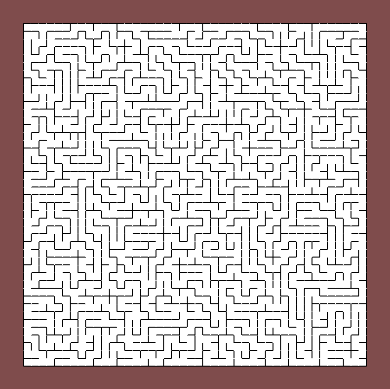

# Maze Generator using OpenGL

First project in OpenGL to get familiar with Vertex Buffer, Vertex Array, Vertex Element Array and the basic API of OpenGL.

I am using two vertex buffers.  
One is for the color of the cells (white -> visited, black -> not visited). Each cell is composed of two triangles. I use a Vertex Element Array to reduce the number of vertices in each cell.  
For the wall I use another vertex buffer, this time without a Vertex Element Buffer.

The generation is animated, where each step of the algorithm ([Depth First Search](https://en.wikipedia.org/wiki/Depth-first_search)) is showed.
Press R to restart a random maze generation.

